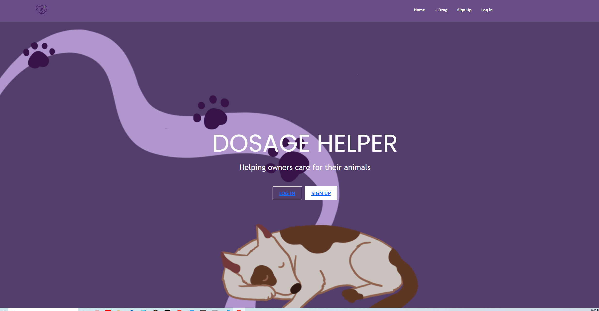
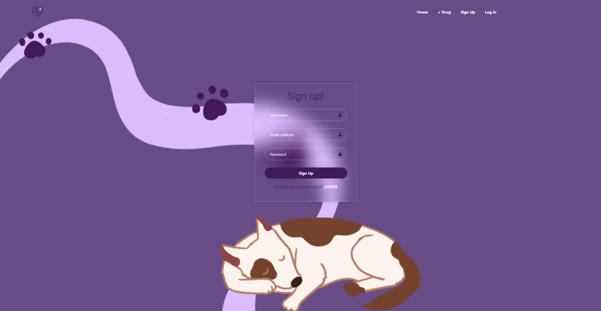
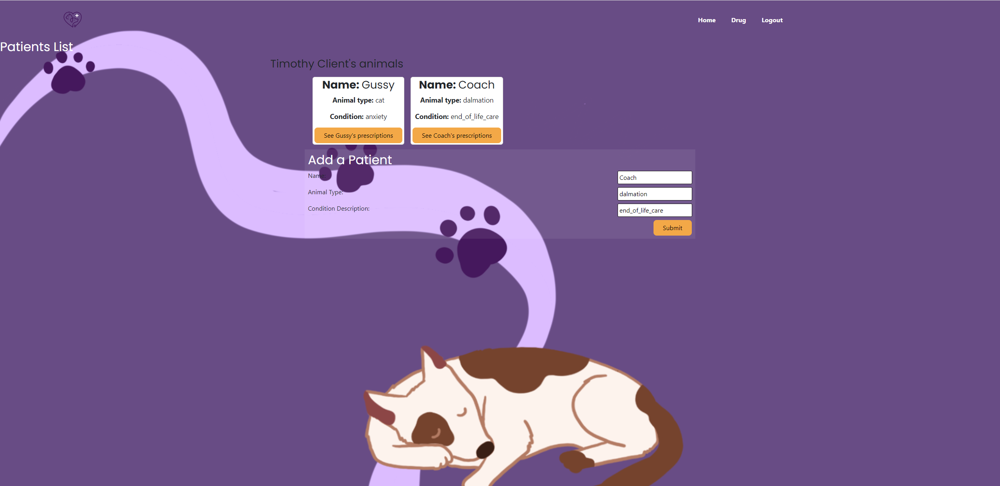
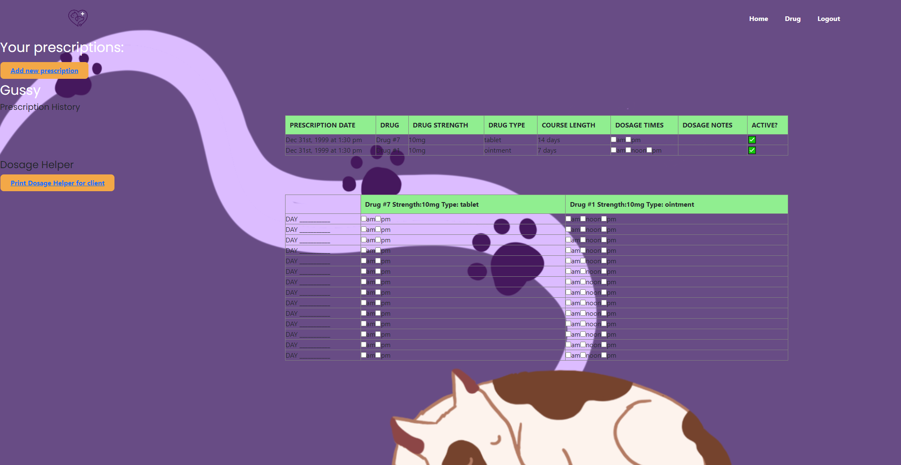

# Dosage-Helper

Bootcamp Project 3

## Description
The motivation for designing this app was for veterinarians to be able to communicate to clients their pets' medical needs with efficacy and ease of access at the forefront. 

## Table of Contents
- [Usage](#usage)
- [Credits](#credits)

## Usage

You can try sample data by logging in as:
email: glenelgvet@gmail.com
password: glenelg123

then go to:
Timothy Client

then go to: 
Gussy

and you will see his prescriptions rendered on the page and in the chart.

---------
To use the 'Dosage-Helper' app, so to this link: https://dosagehelper.onrender.com/
 

Sign up and log in.

Enter your client and their pet (your patient) details.

They'll Never forget a single dose again! With the client checklist, all medications prescribed will appear as a tickable checklist that's easily printed for the client. This way their beloved animals get all the right doses at all the right times.

With further development, this chart will be printable as a PDF. 

In later development stages, we look forward to creating a Client user UI where clients are able to login to the platform and dosageHelper will be an interactive tick list that stores the time the medication was given. This will allow for good communication among multiple owners of the one dog. 

After completing a dose, be sure to tick it off in the chart. 

To see the code and contribute to this project please visit: https://github.com/AmyLloyd/dosageHelper

## Credits

Team Leader: 

Amy https://github.com/AmyLloyd 

Member: 

Andrea https://github.com/mopadeen 
